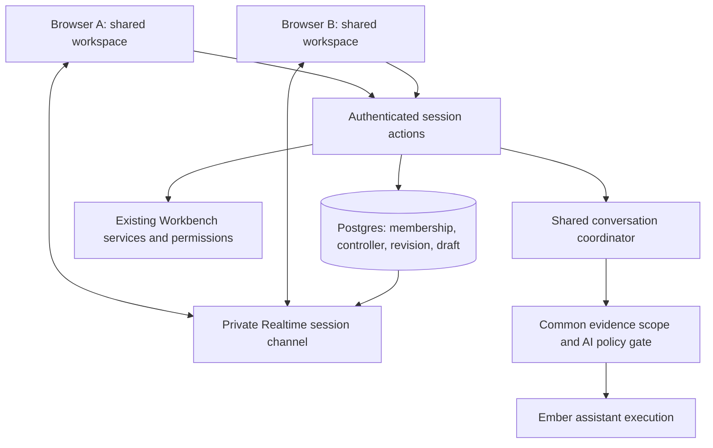

# Shared workspace sessions for remote teams

Status: Phases 1 (session foundation), 2 (shared editing) and 3 (shared Ember chat) implemented behind `NEXT_PUBLIC_EMBER_COLLABORATION`, 6 October 2026; all three migrations are applied to the live backend and verified 6 October 2026; the feature is still off there and not yet tried by two people on a deployment. Phase 0 live gates (Realtime `MissingPartition`, remote-network measurements) remain open. See [Phase 0 findings](design-notes/shared-workspace-phase-0-findings.md) and [the Phase 1 test report](test-reports/2026-10-06-shared-workspace-phase-1.md).
Updated: 6 October 2026. Plan of record on `main` from the Phase 1 PR; originally drafted on `codex/shared-workspace-phase0`.

## Coder handoff: start here

This is the implementation plan for the requested collaboration feature. Read this file first, then the [evidence and outstanding proofs](design-notes/shared-workspace-phase-0-findings.md). The user has moved the branch from assessment into development. It now contains a disabled-by-default session foundation and an unapplied additive migration; it is not a released collaboration feature. The original read-only restriction on application edits is superseded by development authorization. The prohibition on live-data deletion remains in effect.

Every implementation increment must update [Current Architecture](CURRENT-ARCHITECTURE.md), [Roadmap](ROADMAP.md) and [Ember's navigation catalogue](ember/KB-SANDBOX-CAPABILITY-AND-NAVIGATION-CATALOGUE.md) in the same change. `get_navigation_guide` reads that catalogue directly. Mark implemented, enabled and verified separately.

### Phase 1 as built (6 October 2026)

The `codex/shared-workspace-phase0` prototype (one `collaboration_command` function, a separate `/collaboration` page, three-second polling through Server Actions, never applied) was not carried forward; only its approach of testing the SQL in in-memory Postgres was kept. Phase 1 instead:

- **Follows people through the real pages.** A persistent session bar sits under the header on every signed-in page. The observer's browser follows the controller between the bound Project's page and its Workstream pages; no other page is ever mirrored, and an observer who wanders off can **Follow again**. Each browser renders the page with its own user's access. (R1, R2)
- **Control.** Request, grant (requester must be connected), decline, withdraw, host reclaim; leave (control passes on, recorded, if the controller leaves while the other stays); host ends. Each change bumps a server-side control generation that every navigation and grant must match; a second tab of the same person must explicitly take over. Control never moves on disconnect. (R2)
- **Invitations.** **Collaborate** on the Project page, or Ember (`preview_collaboration_invitation`, then `send_collaboration_invitation`, which the code refuses in the same turn as the preview). The invitee accepts or declines from the bar; invitations expire after an hour and only the invitee can answer. (R4)
- **Shared-conversation shell.** One conversation per accepted pair-and-Project, listed under Ember **History → Shared** for both people, with its sessions and **Invite to resume**. No messages yet; nothing from private chats is copied. (R4)
- **Viewers.** Either of the pair can add other active members of the Project as viewers of the shared conversation (at most 20), and remove them; a viewer can remove themselves. Viewers see the conversation in their own history, read-only. They are not told live sessions through extra polling: the ordinary status check every Ember tab already makes says a session is live, and the bar offers **Watch**. Watching makes that one tab follow the controller like the guest's, with no controls (no asking for, being given or taking control; no ending); it polls only while watching, its poll never locks the session, and at most 10 watch at once. The pair sees who the viewers are and who is watching. Watchers never count for the pair's rules (one live session per person, the inactivity deadlines, "everyone left"). (R1)
- **Transport.** Polling straight from the browser to Supabase, never through Vercel; session commands also go browser → Supabase because Next.js serializes a client's Server Actions behind any running Ember turn. Realtime is unused while `MissingPartition` is unresolved. (R7)
- **Data.** `20261023100001_collaboration_sessions.sql` -- additive, re-runnable, never deletes; sessions and invitations end by status. Applied to the live backend on 6 October 2026 (objects and grants verified). (R8)

Decided defaults (each a one-line function in the migration): connected = polled within 90 seconds (a closing tab reports at once); away = no input for 10 minutes; the session ends after 30 minutes with nobody active, after either person has been inactive for 60 minutes, or after 12 hours, with a 5-minute warning; while the controller is away or not connected the other person may take control (recorded; the host can still reclaim); invitation lifetime 1 hour; one live session per person. Invitations show within about 5 seconds for someone using Ember, within 30 seconds otherwise.

### Phase 2 as built (6 October 2026)

Shared editing on the Project and Workstream pages, for the fields in the inventory below (R2, R3):

- **Fields.** Project page: goal, description (objective), starter prompt. Workstream page: summary, deliverables checklist. Only the fields on the page the session is showing can be edited, only by the person in control, and only if their own account may edit that field (the ordinary forms' rules; control never lends rights).
- **Drafts.** Text fields are shared drafts: the controller's typing is sent after a 400 ms pause and the others (including watchers) see it within a poll, marked unsaved; the bar lists every unsaved draft in the session. Save and Cancel are explicit. Typing not yet sent goes out before the controller gives control or leaves, so the next controller continues from exactly that text; a host reclaiming control mid-sentence can lose the last half-second of typing.
- **Conflicts.** A draft remembers the saved text it started from; a save is refused if the field changed outside the session since, and the person sees the saved text and chooses **Keep my text** (then saves over it) or **Discard my changes**. Detected from the field itself -- no version column was added to existing tables. Ordinary edits made outside a session are not themselves version-checked (unchanged behaviour); a later shared save detects them.
- **Checklist.** Each tick saves at once as "set item *n* to done/not done", guarded by the item's label (a reordered or renamed list is refused), so retries never flip an item back.
- **Retries and races.** Saves carry a request id; the same request twice saves once. A save and a handover can't interleave: one commits first and the other is refused, and a refused save leaves the draft open for the next controller.
- **Ending.** Ending the session (by the host or on its own) keeps open drafts marked abandoned and never saves them; End warns which drafts are unsaved. Leaving with drafts leaves them for the other person.
- **Data.** `20261024100001_collaboration_shared_editing.sql` -- additive, re-runnable, never deletes, alters no existing table. Applied to the live backend on 6 October 2026 (objects and grants verified).

### Phase 3 as built (6 October 2026)

Shared Ember chat in a shared conversation (R3, R4). Built behind the same flag; the migration was applied to the live backend on 6 October 2026 (objects and grants verified).

- **Who does what.** In a live session either of the pair asks Ember from their session tab (**Ember chat** in the bar, or the conversation page); each private composer's unsent text stays in that browser. Questions are attributed messages with a server sequence; Ember answers one at a time, in order, for everyone. Ember answers only while both of the pair are in the live session; questions still waiting when it ends are cancelled, not answered. Viewers read the whole chat on the conversation page (the recap, also while watching) and post **comments**; Ember never answers a comment by itself -- either of the pair selects **Ask Ember to respond**, and the answer shows as answering the viewer's comment, passed on by that participant. A viewer who isn't watching adds no polling: their page reloads the chat when they post or select **Refresh**.
- **Evidence everyone can open.** The audience is the pair and the viewers. Ember's only tool is project knowledge search; its results are over-fetched and then filtered to what *every* reader can open by `collaboration_common_evidence`, which evaluates the real row-level security of `knowledge_sources` and `wiki_articles` as each reader in turn (the request's identity claims switched per reader inside one transaction, then restored), so it never drifts from the access rules. Each answer records the evidence it was built from -- the search results Ember was given plus the evidence of earlier answers it was shown -- and a row-level-security policy on `collaboration_messages` shows an answer's text only to readers who can still open all of it; others see "Hidden -- this answer drew on sources you can't open". Earlier answers built on anything not everyone can open are left out of Ember's context (a placeholder in their place). Adding a viewer can therefore narrow what Ember uses and hides such earlier answers from that viewer; removing one widens later turns only. Losing access to a source hides those answers from that person straight away.
- **Turns.** `collaboration_turns` is a durable queue: `queued → running → done | failed | cancelled`. A question carries a request id (a retried send posts once). A Route Handler (`/api/collaboration/turns`, not a Server Action, so it never blocks the browser's other actions) runs waiting turns with the service role: claiming takes a 150-second lease (one running turn per conversation); completing records one reply per turn, refused for a stale lease; a run that stops is retried once, then failed. The browser starts the runner after asking, and any participant's poll starts it again when work waits with nobody running it -- harmless if two do. A failed answer shows to everyone, with **Ask again**.
- **Restricted Ember.** Search only -- no workspace changes, notes, invitations, web search, working knowledge, gateway or personal-memory tools; it says so if asked to act. The platform's default chat model, or a Sandz-hosted one where the Project requires it; never a builder's own LLM. The information-sensitivity check runs before every model call, as in personal chat. A builder's own lab Project is metered against the builder's allowance whichever of the pair runs the turn. No conversation summary yet (the latest 30 messages are Ember's context).
- **Data.** `20261025100001_collaboration_shared_chat.sql` -- additive, re-runnable, never deletes, alters no existing table; it redefines the two Phase 2 snapshot functions to add the chat's state. Two new tables; `collaboration_messages` is readable through its policy (a SELECT grant to signed-in users, the only direct table grant in the feature); writing is through functions only, and claiming, completing and failing a turn are callable by the service role only, so no browser can write an Ember answer. Paste-in copies for the SQL Editor: `supabase/paste-in/20261025100001_collaboration_shared_chat_part1..3.sql`.

### Phase 3 completed (7 October 2026)

Finishes the shared Ember chat (R3, R4). The migration (`20261027100001_collaboration_shared_chat_tools.sql`) was applied to the live backend on 7 October 2026 (objects and grants verified).

- **Summary.** Ember sees the latest 30 messages. Once at least ten more have fallen outside that window, the app server writes a new summary of them after the answer (the same model and sensitivity check), from common evidence only: earlier answers built on anything not every reader can open are left out, and the summary records the evidence it drew on. A summary is readable under the same rule as answers, and Ember uses it in later turns only while every reader can still open all of it. Summaries are kept, never replaced in place. Either of the pair can review the summary on the conversation page (**Show summary of earlier messages**), edit it and **Publish as Project note** to the project team, as its author.
- **More tools, reviewed one by one.** `list_workstreams` and `list_project_members` (read-only; every reader of the conversation is an active Project member who sees the same lists). `propose_project_note` and `propose_field_edit`: Ember only proposes, the proposal is stored on its answer (so it's hidden wherever the answer is), and a person acts with their own rights -- either of the pair reviews a proposed note and sends it as themselves (to one member or the project team); the person in control, on the field's page and with the right to edit it, selects **Put in shared draft**, then reviews and saves under the Phase 2 rules. Proposals can be dismissed; each is used once and everyone sees what became of it.
- **Wider audiences.** A note and a Project field reach more people than the conversation, so publishing a summary, sending a proposed note or using proposed field text first checks that every active Project member can open the evidence behind it (`collaboration_evidence_project_visible`, the real access rules evaluated as each member). A Project that isn't private takes proposed field text only if it used no evidence at all. Platform administrators can read notes in Projects they oversee; they aren't checked individually.
- **Not done.** No conversation-wide re-summarizing after access changes (a summary that stops being common is skipped, and the next summary covers only later messages); Ember still has no tool that changes anything itself.

### Phase 4 pilot kit (7 October 2026)

What the remote pilot needs:
- **[Pilot checklist](guides/shared-workspace-pilot.md):** ten steps for two people at different locations plus a viewer, on the Vercel preview with the real AI model. It covers Firefox, Safari and a phone.
- **[Results template](test-reports/templates/shared-workspace-pilot-results.md)** to record the pilot.
- **Connection check** in the session bar, for each person and browser: round trips to the server, failed checks, round trips for their own actions, how long the other person's changes took to arrive, and Ember answer times. Everything is measured on that browser's own clock, so no clock agreement between the two computers is needed. **Copy results** gives text for the template: timings and the browser only, never content.

No database change.

### Phase 4 operations, as built (7 October 2026)

The first part of the remote pilot and release phase: being able to see and fix problems, and checking behaviour on poor networks. The migration (`20261028100001_collaboration_operations.sql`) was applied to the live backend on 7 October 2026 (objects and grants verified).

- **Monitoring.** **Admin → Live collaboration** (platform admins, when the flag is on): live sessions with presence, control, deadline, watchers, Ember state and unsaved drafts; problems needing attention (stalled or failed Ember answers, notes stuck sending, sessions past their deadline); counts for 24 hours, 7 or 30 days (invitations, sessions by end reason, control changes, saves, abandoned drafts, answers and retries, answer time, comments, summaries, notes sent). Names and statuses only, never content.
- **Recovery.** End a live session ("An administrator ended the live session"; drafts kept as abandoned), settle overdue sessions, cancel a stalled Ember answer (the pair can ask again), reset a note stuck sending to failed. Each is a status change recorded in `collaboration_events` with the admin as actor; refused for anyone else and for external MCP tokens. [Runbook](guides/shared-workspace-sessions-runbook.md).
- **Poor networks.** The browser now polls at once when it comes back online (previously up to the 30-second failure backoff), and the bar shows "Connection lost — reconnecting…" after two failed polls in a row, while in a session or watching. Checked on simulated slow and lossy networks, offline periods and a phone-sized screen (Chromium; see the test report). Firefox and Safari are left to the pilot: they can't be installed in the development container.

### Requirements and design decisions

The user requested the following outcomes and constraints:

| ID | Requirement | Delivery |
|---|---|---|
| R1 | Two users at remote locations see the same Ember workspace in separate browsers; this is shared application state, not screen video | Phases 1–2 |
| R2 | Either user can request navigation and data-entry control | Phase 1 control protocol; Phase 2 forms |
| R3 | Initial supported editable surfaces are Project, Workstream and Ember chat; allow more screens later through explicit integration | Phases 2–3 |
| R4 | Collaboration can start through Ember, with the shared conversation available in each participant's chat history | Phase 1 invitation/history shell; Phase 3 AI |
| R5 | Later include a voice connection and optional AI transcription | Phase 5, separately estimated |
| R6 | Start with Phase 0, no application code edits during the initial assessment; any necessary prototype belongs on its own branch | Current work and Phase 0 spike |
| R7 | Use the existing Vercel preview; it shares the live Supabase backend, with no separate Ember Supabase available | All live verification |
| R8 | Preserve all existing data; additive tests and test chat history are allowed, deletion is prohibited | Every phase and test procedure |

The following are proposed implementation defaults developed during the assessment, not additional user requirements: a fixed pair of existing Project members; one Project per conversation; one controller for navigation/forms; independent chat composers for both users; a new shared conversation without copying personal history; participant-only retained history subject to continuing access; and shared AI sends requiring both users to be joined initially. Finalize retention durations, invitation expiry, lease timing and provider policy during Phase 0 rather than treating them as settled product settings.

### Current checkpoint and next work

Phase 0 is **in progress**. Architecture/source review, initial signed-in UI inspection, a fresh member test account, and a limited personal-history isolation query are complete. Private Realtime channel joining failed with `MissingPartition`; the cause is not established. On 6 October the user successfully connected from their own PowerShell session with the saved database URL and supplied CA certificate. Earlier agent attempts failed authentication; the successful user-run query verifies connectivity in that session, not a completed Realtime diagnosis.

Execute the remaining work in this order:

1. Reproduce a certificate-verified database connection from the execution environment. Inspect Realtime partition/catalog metadata and available service/version evidence read-only. Preserve a sanitized proof log; never copy connection strings, passwords or keys into Git.
2. Diagnose `MissingPartition` and propose a supported remedy if necessary. Do not change live service configuration, schema or access policies as an incidental troubleshooting step. Connection success alone does not pass the Realtime gate.
3. Finalize the supported-field inventory, session state machine, shared-history/access model, turn queue and schema proposal. Record unresolved product choices and the test matrix.
4. Prepare a small isolated Phase 0 prototype on this branch after reading the installed Next.js guides. Prefer local disposable infrastructure for schema and concurrency experiments. Local isolation is a proposal, not an existing lab. Keep live tests additive and non-destructive; never drop, truncate, reset or clean up live fixtures.
5. Run two-account/two-browser admission, navigation, handover, conflict, reconnect, revocation, common-evidence and queue proofs. A single-user page inspection or successful SQL login is insufficient.
6. Publish evidence against each exit gate, remaining risks, the proposed migration/deployment approach and a revised estimate before proceeding to the full implementation.

### Branch and handoff practice

Keep this plan and its evidence log together on `codex/shared-workspace-phase0`, even before they reach `main`. Other coders should fetch and check out that branch, then read these two documents before implementing. Reference the requirement IDs above and the phase/exit gate in implementation PRs. Record what actually passed and distinguish source findings, user-reported checks and directly observed live checks. Update this plan as decisions change; do not silently expand the shared-screen or tool allowlist.

Secrets, certificates used by local probes, test-account credentials and temporary client dependencies remain outside the handoff in Git-ignored local files. The test account has no added Project membership, so it is not ready for two-user Project tests. Do not run the bulk account seed scripts against the live backend: they can reset existing test users.

Phase 0 live checkpoint: the user confirmed that the Vercel preview shares the live Supabase backend and authorized additive tests with no deletion. Browser access and a fresh member test account now work. The initial private Realtime channel probe returned `MissingPartition`; investigate before treating the transport as ready. No application code, schema or service configuration has changed. References below to a separate lab are preferred future isolation, not the current deployment reality; do not delete test fixtures on the shared backend.

## Outcome and agreed scope

Two signed-in users at remote locations work together in the same Ember workspace in their own browsers. They share navigation and draft data, and either can request control. One participant controls the shared workspace at a time. Initial supported surfaces are Project, Workstream, and a new shared Ember conversation. Additional screens can be added through the same integration contract.

This is application-state synchronization, not desktop capture. Matching content and selected sections matter; identical pixel layouts across different screen sizes do not.

Voice and optional AI transcription are a later phase. The initial release works alongside whatever calling tool the participants already use.

## Proposed experience

1. Start from Ember in a Project: ask to collaborate with an existing active Project member, review the selected person, and confirm the invitation. A **Collaborate** button offers the same flow. Acceptance creates a new shared conversation listed in both participants' histories; no private conversation content is copied. Invitations expire; forwarding a link cannot grant access.
2. A persistent session bar shows the Project, both participants, connection status, and current controller. Starting the session makes the host the controller.
3. Both browsers show the controller's supported Project or Workstream page, selected section, open shared form, and draft values. Shared Ember chat is available within that Project.
4. The observer selects **Request control**. The controller grants or declines. The host may reclaim control through a visible, server-recorded transition. Control never transfers silently because someone disconnects.
5. On handover, the next controller receives the latest acknowledged draft. Pending saves finish or are reconciled before handover. Unsaved edits remain visibly unsaved.
6. Save or Send is explicit. The controller can only perform workspace actions their own account is authorized to perform. Both participants may compose and send chat messages independently; Ember handles accepted messages sequentially. Composer drafts remain personal until sent. A participant with view-only rights can navigate and, if permitted, ask Ember, but cannot edit protected fields. Checklist clicks remain explicit immediate saves and use an idempotent set-value operation.
7. Either participant can leave; the host can end the session. A disconnected session pauses shared writes and offers reconnect or end. Leaving with drafts offers an explicit save/discard decision where authorized; it never silently saves.
8. At the end, both can revisit the shared conversation from their histories, subject to continuing access. Ending a live session does not delete the conversation. Either may invite the other to resume a new live session on that conversation. Initially, new shared AI turns require both participants to be joined. Publishing a summary to a Project note is a separate explicit action.

Session controls persist across supported routes. Unsupported or private destinations prompt the user to leave the shared workspace; they are never mirrored automatically. Existing personal chat and notification contents remain outside the shared surface.

## Architectural fit and current gaps

Repository findings reviewed for this plan:

| Foundation | Reuse | Gap |
|---|---|---|
| Next.js App Router and common signed-in layout | Mount a persistent collaboration provider and session bar | No shared session UI or state coordinator |
| Supabase Auth, Project membership, server checks and RLS | Participant identity and normal object permissions | Session-specific authorization and revocation |
| Server Actions and Workbench services | Existing domain validation and saves | Controller validation, conflict detection and retry protection |
| Browser Supabase client | Candidate transport for private Realtime channels | No Realtime subscription layer found in app code |
| Local React form state | Adapt existing Project and Workstream forms | Drafts currently exist in one browser only |
| Personal conversations and bounded assistant tool loop | Reuse generation and presentation components where appropriate | Shared ownership, author attribution, common evidence scope and coordinated execution |
| AI registry and sensitivity policy | Extend existing governance patterns | No audio/transcription provider contract |

The deployment guide currently treats Supabase Realtime as unused and skips its smoke tests. Verify the actual hosted/self-hosted service, private-channel authorization, browser connectivity through the gateway, and resource usage before selecting it for production.

## Proposed architecture

Realtime distributes change notifications; it is not the authority for membership, controller identity, or permission to save. Initially fetch content through freshly authorized server reads rather than broadcasting draft/chat bodies. Use server-validated state transitions and database transactions for authoritative session state. Do not trust user IDs or controller claims inside browser event payloads. Phase 0 must measure the latency of this notification-and-fetch approach.

### Data and lifecycle

Proposed records, with exact schema settled in Phase 0:

- `collaboration_sessions`: shared conversation, Project, host, status, current controller, control generation, expiry, authoritative state revision and supported location. One persistent shared conversation may have multiple successive live sessions.
- `collaboration_participants`: invited account, invitation state, joined/left timestamps and session role. Keep the admitted pair fixed; replacing a participant starts a new session.
- `collaboration_drafts`: allowlisted screen/entity/field state, revision, base resource version and draft expiry. Store enough acknowledged state to recover from a browser refresh without treating it as saved business data.
- `collaboration_events`: minimal server-attributed join, leave, handover and save events. Avoid logging every keystroke or duplicating private content.
- Shared conversation membership, message author, and turn-execution records. Phase 0 recommends separate shared-conversation tables and a unified history DTO, keeping personal conversation RLS unchanged.

Use an expiring controller lease and a monotonic control generation. Every shared workspace mutation must atomically validate participant, controller generation, lease, state revision and normal resource permission. Chat submission validates participant/live-session access and uses its own durable queue rather than the controller lease. Reject stale workspace updates after handover. Membership and account revocation must stop new authorized content reads and writes, including for already-connected clients; channel-join checks alone are insufficient. Realtime notifications must contain no content or sensitive labels. Verify closure/rotation and membership refresh behavior during the spike. Previously delivered content cannot be recalled from another device.

### Synchronization contract

Each supported screen declares allowed route/resource IDs, selected section, shared fields, validation, and save behavior. Use semantic entity/field identifiers, never arbitrary DOM events or unrestricted URLs.

Debounce draft updates, acknowledge authoritative revisions, discard duplicate events, and fetch a fresh snapshot after reconnect. Presence may be transient; acknowledged draft content must be recoverable. Do not automatically replay uncertain saves or AI tool actions.

Shared saves need optimistic concurrency against edits made outside the session too. Show a conflict and allow review/reload rather than silently overwriting a newer resource. Decide version-column or equivalent compare-and-swap implementation during the spike, and use a transaction so controller validation cannot race a save.

### Access boundaries

- Both participants must independently have access to every shared resource. Project membership alone does not establish access to restricted evidence or private records.
- Navigation is limited to the bound Project and supported resources. Do not mirror admin pages, personal chat, journals, private notebooks, credentials or unrelated Projects.
- Control changes interaction rights within the session; it does not delegate the host's account or elevate the recipient's role.
- Invitation, channel, snapshot, draft, history and artifact paths all need authorization. UI hiding is not enforcement.
- Start with ordinary edits. Membership changes, publishing, approvals, deletion, promotion, uploads and external-agent execution are outside the initial shared-action allowlist.
- Keep session content within the deployment boundary; cross-instance collaboration is excluded.

### Shared Ember conversation

**Viewers in Phase 3 (requested 6 October 2026).** A shared conversation's viewers (added in Phase 1) can read a recap of the session's shared Ember chat, and can submit a comment or message to Ember in that same shared chat. Consequences for the design below: everyone who can read the chat -- the pair *and* its viewers -- is the audience, so the common evidence scope is the intersection of all their access, not just the pair's (adding a viewer can narrow what Ember may use; removing one may widen it only for later turns); a viewer's message is attributed like any other, goes through the same ordered turn queue, and needs no workspace control; the recap and its summary follow the same access and revocation rules for viewers; and a viewer who loses access stops seeing new content without ending anything for the pair. Decided 6 October 2026: a viewer's message is a **comment** in the shared chat, visible to the pair and the other viewers; Ember does not answer it. Either of the pair can pass a comment on to Ember, which then answers it as a turn attributed to the viewer who wrote it and to the participant who passed it on.

Create a new explicitly shared conversation. Never attach a participant to an existing personal conversation implicitly. Bind it to the Project and the fixed participant pair.

Record the human author of each message. Both participants may submit using independent private composers; at most one assistant turn may execute at a time. Assign accepted messages a server sequence and show queued/answering/failed states. Use an idempotency key and durable turn state so retries and refreshes cannot duplicate accepted messages or committed replies. Navigation/control handover can continue during read-only Q&A; pin each turn to its accepted context and never let a late reply force navigation. Any later tool that mutates workspace state must revalidate the actor's authority and current control when executed. Provider retries can incur repeat inference costs even if duplicate committed replies are prevented.

Assemble retrieval and AI context from resources readable by both participants, including history, summaries, citations, tool results and generated artifacts. The acting user's normal retrieval scope alone is not sufficient. If effective access shrinks, pause the conversation and revalidate; do not resend previously accessible evidence from stored summaries. Historical access checks must account for derived text that may contain restricted evidence, not just hide its citation links.

Begin with Q&A, shared-safe retrieval and navigation. Disable personal-memory/notebook tools and unaudited mutation or external tools for shared conversations. Add individual tools only after reviewing actor identity, shared output access, confirmation authority, retry behavior and audit attribution. Permission-sensitive confirmations cannot be inherited by a new controller.

Proposed history default (extended 6 October 2026 to the viewers the pair adds, while they too remain authorized): readable only by the two participants while they remain authorized for the Project and underlying content, not by the whole Project. Apply a configurable retention policy. A reviewed summary can be explicitly published as a Project note using existing note permissions.

## Delivery plan and gates

These are planning ranges in engineering weeks for one experienced developer with review and testing support, not delivery commitments. They include meaningful integration testing but depend on the spike; calendar time also depends on competing work and deployment access.

| Phase | Scope and visible result | Indicative effort | Exit gate |
|---|---|---|---|
| 0: prove the difficult parts | Two-browser prototype; private Realtime connectivity; atomic handover/save approach; common chat-access design; field inventory | 1–2 weeks | Demonstrate join, navigation, reconnect and rejection of stale/unauthorized writes; resolve chat isolation design |
| 1: session foundation | Ember invitation entry, shared-conversation shell in both histories, session bar, presence, host/end controls, shared navigation, control requests, lease and revocation | 2–3 weeks | Remote pair can join, follow, exchange control and recover without ambiguity; shared AI turns remain disabled until Phase 3 |
| 2: Project and Workstream editing (built 6 Oct, see above) | Shared drafts and saves for allowlisted fields; conflict detection; unsaved-state and unsupported-route behavior | 2–3 weeks | Both users can edit in turn with no lost acknowledged drafts or silent overwrites |
| 3: shared Ember chat (built 6 Oct, see above) | Shared conversation/history, author attribution, common evidence scope, single-turn coordination; viewers read a recap and can post to the same chat, restricted tool set | 3–4 weeks | Both see one consistent conversation; isolation and duplicate-execution tests pass |
| 4: remote-location pilot and release (operations built 7 Oct, see above) | Feature flag, operational monitoring, browser/network validation, usability fixes and deployment docs | 1–2 weeks | Pilot users complete real remote work; recovery and access-revocation cases pass |
| 5: voice and optional transcription | Session audio, mute/reconnect, consent, attributed transcript and reviewable summary | Estimate after media/provider spike; excluded below | Two-location audio and relay tests pass; consent, access, retention and failure recovery verified |

Initial complete release: approximately **9–14 engineering weeks**, subject to re-estimation after Phase 0. A useful Project/Workstream pilot can begin after Phase 2, approximately **5–8 engineering weeks**, while shared chat is built. These are working estimates, not measured repository implementation times.

### Initial field coverage

- **Project:** goal, objective and starter prompt, subject to each field's existing edit rules. Shared browsing of approved sections of the Project page. Inventory other editable controls in Phase 0 and mark them unavailable in shared mode until integrated.
- **Workstream:** summary and deliverables checklist. Add goal/scope fields only where an existing supported editing path is confirmed during the inventory.
- **Ember chat:** independent private composer drafts, shared attributed messages, queued turns, current progress, final response, shared-safe citations and authorized navigation.

This provides editable support for all three requested surfaces without implying every administrative control on those pages participates in the first release.

## Acceptance and test plan

Use service/RLS tests for invariants and two independent authenticated browser contexts for end-to-end tests. Test with different accounts, roles and evidence grants; two tabs in the same login are insufficient.

1. Only the invited active member can join; expired, forwarded and reused invitations cannot bypass admission.
2. Both browsers follow supported navigation and draft updates, without exposing private UI.
3. Simultaneous control requests produce one controller. Former-controller, forged and expired-lease events fail server-side.
4. Handover preserves the latest acknowledged draft. Save retries do not create duplicate operations.
5. A viewer cannot gain edit privileges by accepting control. Resource changes outside the session cause a visible conflict.
6. Drop either connection, refresh either browser, and simulate delayed/reordered events. Resume from an authoritative snapshot or show a clear paused state.
7. Remove membership or evidence access while connected. Reads, broadcasts, writes, history and AI context stop exposing revoked content.
8. Shared chat produces one attributed human message and one coordinated assistant turn per accepted send, including after retries.
9. Evidence available only to one participant never appears in shared answers, summaries, citations, progress or tool output.
10. Personal chats and personal assistant behavior remain unchanged. Shared-mode tool restrictions cannot be bypassed through crafted requests.
11. End/expire a session; channels close, control ceases and drafts follow retention rules.
12. Test real remote locations with target browsers, modest bandwidth, latency and brief outages. Provisional target: acknowledged navigation/draft updates visible within one second at p95 under the agreed pilot network profile; measure and refine in Phase 0.

Collect join success, reconnect success, synchronization latency, rejected stale writes, conflicts and AI-turn failures without logging draft text. Browser connection counts and Realtime traffic must be measured before setting deployment capacity or cost estimates.

## Phase 5: voice and transcription

Add WebRTC audio attached to the same session, with mute, connection indicators and tested TURN relay support for restrictive networks. Audio must use a media transport, not the session Broadcast channel. Choose a managed or self-hosted service according to deployment requirements after a media spike.

Transcription is separately enabled with visible participant consent. Add a transcription-provider interface, approved-provider/sensitivity enforcement, duration-based usage/cost accounting, speaker attribution, transcript access and retention controls. Avoid retaining raw audio by default. Start with a reviewable transcript and draft session summary; publication remains explicit and does not approve it as canonical knowledge. Voice failure should not end the shared workspace.

Estimate this separately after the shared-workspace pilot and provider/deployment decision; it is not included in the 9–14 week estimate.

## Rollout and decisions for review

Ship behind a deployment feature flag, enable selected Projects first, then expand supported screens only after each adapter passes the shared-session contract tests. Database migrations should be additive. Disabling the feature stops new sessions and safely ends active sessions while preserving ordinary Project/Workstream use and authorized retained history.

Recommended defaults for review: exactly two existing Project members, one Project per session, one controller, fixed participant pair, new shared chat, retained participant-only chat history, and explicit publication of summaries. Draft/history retention durations and enabled fields should be finalized before the pilot; use configurable expiry rather than indefinite retention.

Phase 0 is authorized. Begin with the read-only assessment; any necessary prototype code must be on its own `codex/` branch. Its full exit deliverable remains working evidence and a revised estimate before building the full feature. A source review alone does not pass the two-browser or deployed Realtime gates.

## References

- [Current architecture](CURRENT-ARCHITECTURE.md)
- [Existing collaboration scope](m5E.md)
- [Role-aware Project and assistant experience](dev-request-role-aware-project-views-and-ember-first-workspace.md)
- [Dedicated-instance architecture decision](architecture-decisions/ADR-0001-dedicated-instance-first-deployment.md)
- [Self-hosted Supabase deployment](guides/ember-on-self-hosted-supabase.md)
- Implementation touchpoints: `src/app/(app)/layout.tsx`, `src/lib/supabase/browser.ts`, `src/lib/auth.ts`, `src/app/actions/projects.ts`, `src/lib/workbench/projects.ts`, `src/components/projects/ProjectGoalForm.tsx`, `src/components/projects/ProjectObjectiveForm.tsx`, `src/components/projects/ProjectStarterPromptForm.tsx`, `src/components/projects/WorkstreamSummaryForm.tsx`, `src/components/projects/DeliverableChecklist.tsx`, `src/components/chat/ChatPanel.tsx`, `src/lib/chat/conversations.ts`, `src/lib/chat/loop.ts`, `src/lib/ai/provider.ts`.
- [Supabase private Realtime authorization](https://supabase.com/docs/guides/realtime/authorization)
- [Supabase Broadcast](https://supabase.com/docs/guides/realtime/broadcast)
- [Supabase Presence](https://supabase.com/docs/guides/realtime/presence)
